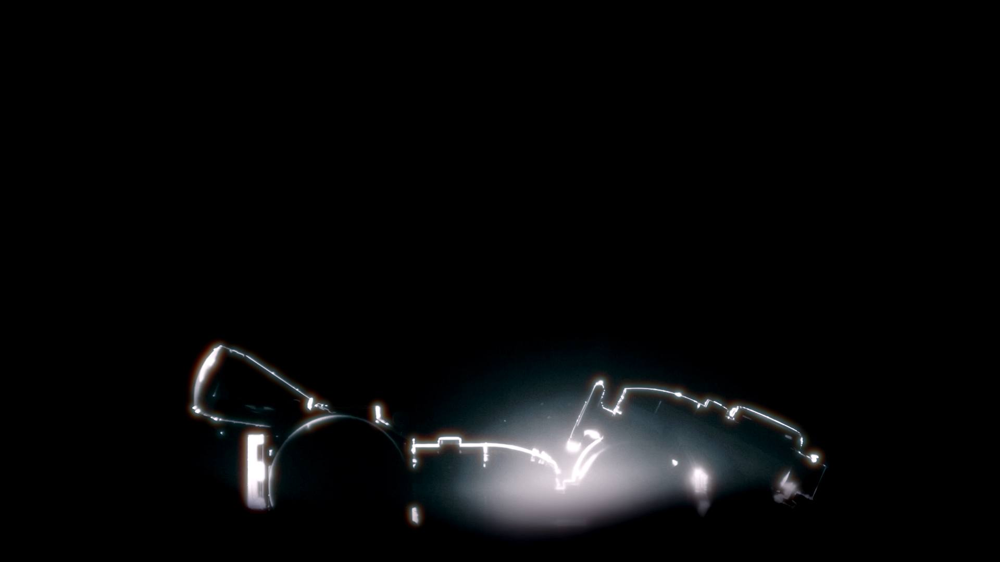
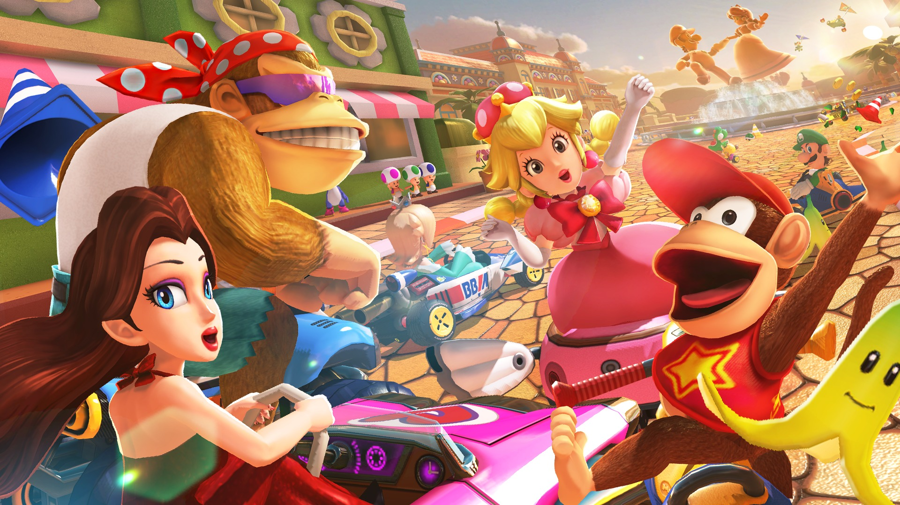
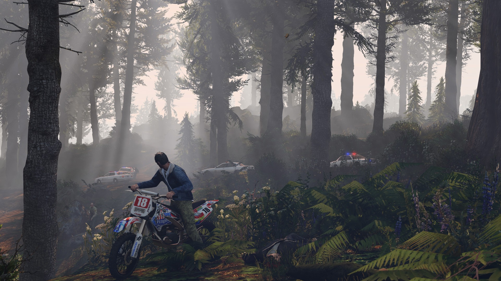
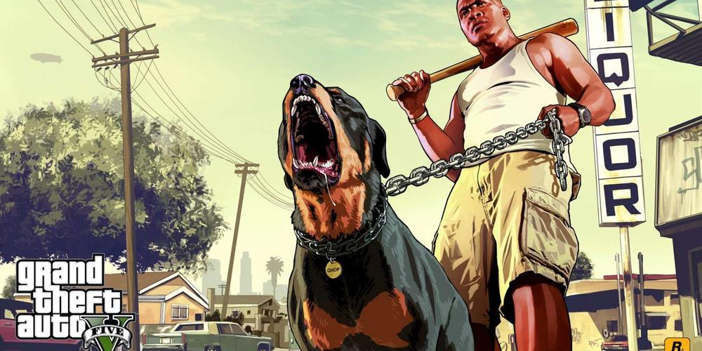
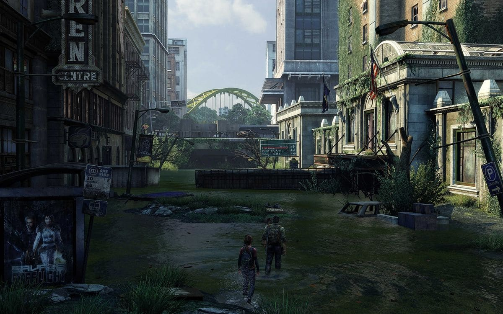
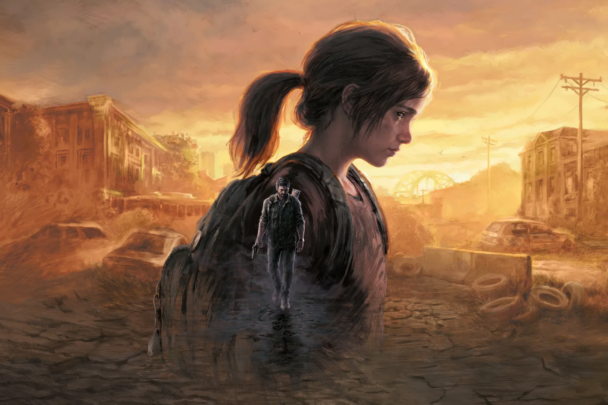
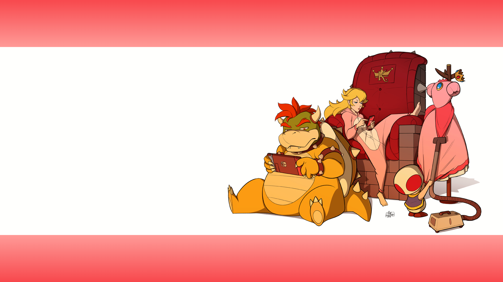
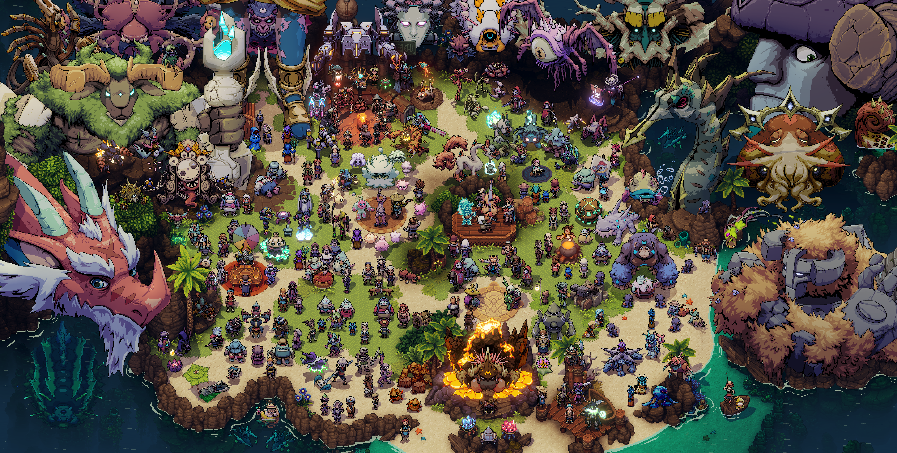

# Repo : Blog en Php procédural

## Préparer sa conception avec un brainstorming (Philippe)
//Tâches
Menu avec les catégories
    html
    sql getAllCategories()

category.php

category.tpl.php

sql

sql getPostsByCategory()

## Article
<h3>Vieux, mais pas obsolète</h3>

Malgré la popularité toujours conséquente de certains titres, force est de constater que certains d'entre eux trustent les étals de nos magasins favoris, aussi bien que des plus trending de nos tiktok, alors que leur suite se fait toujours attendre. Véritables mines d'or pour leurs éditeurs, ils représentent une source illimitée de publicité et de richesse pour leurs prestigieux studios. Voici quelques exemples de ces jeux exceptionnels.

<h3>Skyrim 11/11/11 (14 ans)</h3>

 Comment ne pas évoquer Skyrim dans cet article? Sorti en 2011, le titre reste encore aujourd'hui une référence ultime dans le domaine des RPG. Symbole du basculement de la base de joueurs dans le RPG à l'occidentale, il est connu pour son univers cohérent, ses graphismes incroyables toujours agréables et la richesse de son écriture et de son ambiance

<h3>Minecraft  18/09/2011</h3>

Parmi les grosses performances, on l'a vu, il y a surtout des suites de titres connus, mais pourtant la plus impressionnante de toutes se réclame des nouvelles IP au concept innovant qui a leur sortie étaient originales et inégalées. C'est le cas du loup blanc MineCraft, le jeu le plus vendu de tous les temps

<h3>MarioKart 8  29/05/2014</h3>

Malgré sa date de sortie plus tardive que nos autres arlésiennes, MarioKart 8 est un très impressionnant témoin de la toute puissance d'une licence. Souvent imité, jamais égalé malgré nombre de titres de grande qualité (Crash team racing, Diddy kong Racing, Chocobo grand Prix), Chaque épisode de MarioKart représente un system seller ultime et surtout un incontournable et ce peu importe son support.
 
Parmi tous ces épisodes, le 8ème de la saga est très particulier car il a été le jeu le plus vendu de la flopesque Wii U qui malgré son échec avait plus des trois quarts de son parc équipé de sa version de MK8. Après cette performance déjà incroyable, sa ressortie le 28 avril 2017 sur l'ultra populaire Switch le propulse en jeu le plus régulier de la machine, avec une stabilité insolente : il est encore aujourd'hui (avril 2024) dans le top 5 des meilleurs ventes de la console la plus vendue de sa génération.

<h3>Gran Theft Auto V  17/09/2013</h3>

Attention, Gros morceau. Déjà issu d'une si ce n'est de la série de jeux la plus populaire qui soit, le très attendu GTA V débarque en 2013 et la claque est sévère. En terme de technique, de possibilités de gameplay, de richesse de contenu, et d'écriture, le titre va poser les standards de toute la production vidéoludique pour les années à venir.
 
Veritable phénomène de société, GTA transcende les styles pour proposer un gameplay entre TPS et aventure où on passe pourtant la plupart de notre temps a conduire des voitures. Sorti et ressorti d'une génération à l'autre de consoles, l'annonce de sa suite en 2024 a tellement retenti que même en dehors du milieu des Jeux Vidéos, GTA est connu par sa réputation sulfureuse et surtout par son importance dans le paysage du Gaming moderne
 

<h3>The Last of Us 14/06/2013</h3>

Petite exception à la règle, puisque sa suite est quand même sortie au moment d'écrire ces lignes, mais si GTA représente les consoles en général, Skyrim l'arrivée des joueurs PC dans le JV Mainstream et MK8 la touche Nintendo, Sony peut compter sur son studio star Naughty Dog pour proposer des titres a l'aura inégalée. Si Uncharted est leur proposition la plus connue en 2013, c'est bien The last of us qui va dépasser les frontières et offrir une histoire a la portée inégalée. Aujourd'hui disponible sous forme de série HBO et considéré comme un produit culturel populaire, cette histoire de Zombies et surtout de survivants, si elle n'est pas forcément louée pour ses qualités vidéoludiques, est néanmoins la plus marquante des expériences pour bon nombre de joueurs.
 

<h3>La fin des grands jeux?</h3>

Malgré l'abondance de projets pharaoniques et de jeux exceptionnels, on constate qu'un cap a été franchi entre 2011 et 2014 avec des jeux qui ont transformé la face du média durablement. Si beaucoup d'excellents jeux sont venus ensuite (The Witcher 3, Zelda Breath of the wild ou Fortnite par exemple), qui eux aussi ont pulvérisé l'existant par leurs propositions solides, force est de constater que le jeu vidéo à changé : la technique et le gameplay ne peuvent plus distancer les vieilles productions comme avant l'époque des consoles de 6ème voire de 7ème génération. En effet après le carton de la PS2 face a ses rivales Xbox et GameCube, les graphismes sont encore monté d'un cran avec la génération suivante, mais aujourd'hui près de 20 ans après nous voyons la Nintendo Switch, d'une puissance comparable a celle de la xbox 360 et de la ps3, écraser la concurrence qui a deux générations d'avance avec un parc de plus de 132,46 millions d'unités contre les 117 millions de la playstation... 4.
 En effet, la 5ème édition peine déjà a égaler sa grande soeur tant la différence de puissance tarde a se faire réellement sentir. Cette absence de "claque next-gen" est peut être un signe de la fin des générations de consoles, pour entrer dans une ère nouvelle ou le temps et la qualité de production des jeux ferait la différence, tandis que les jeux de l'années se suivent et brillent de moins en moins pour leur technique, avec des duels improbables comme Celeste qui affronte sur un pied d'égalité le mastodonte Red Dead Redemption II (aux graphismes d'ailleurs inégalés depuis 2018).

Nous vous laissons avec la liste des GOTY des cinq dernières années pour méditer...

<h4>Game Of The Year des game award par année</h4>
<ol>
    <li>2019 - Sekiro : Shadows Die Twice</li>
    <li>2020 - The Last Of Us Part II</li>
    <li>2021 - It takes two</li>
    <li>2022 - Elden Ring</li>
    <li>2023 - Baldur's Gate III</li>
</ol>
